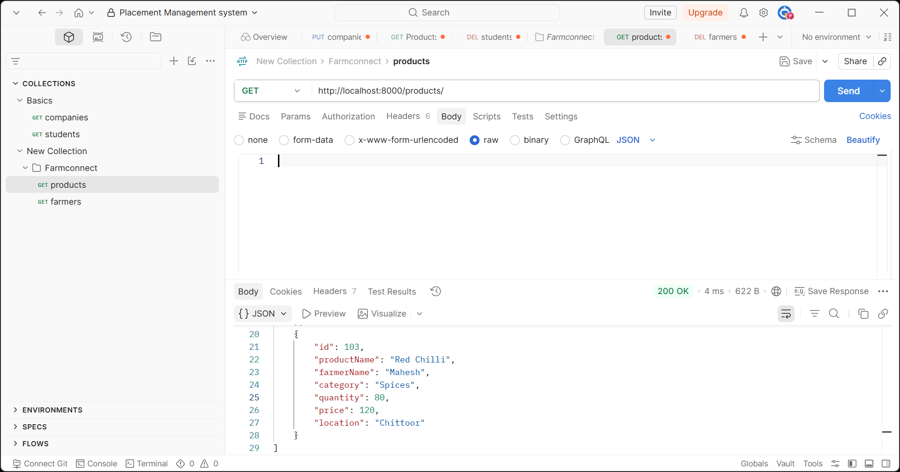
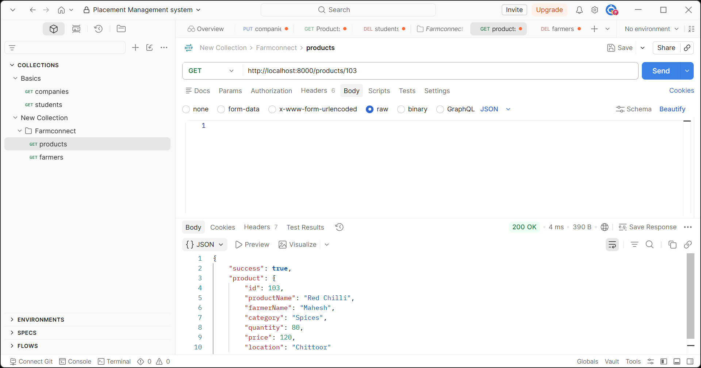
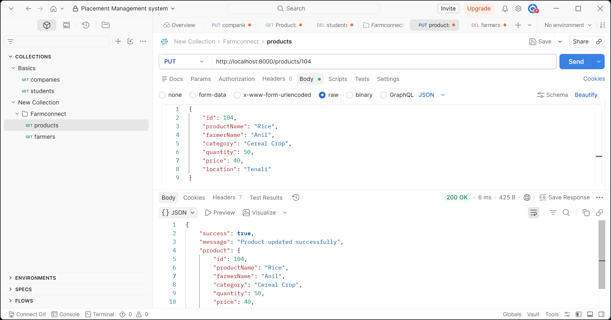
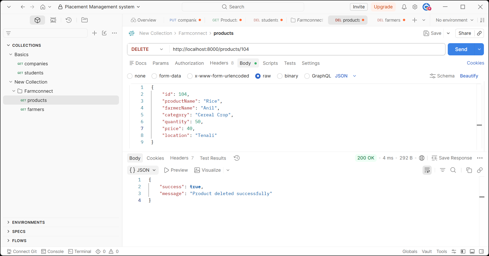
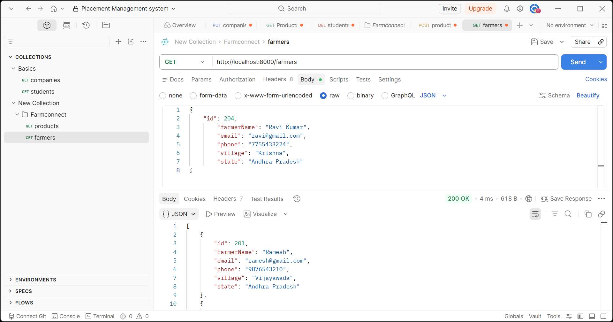
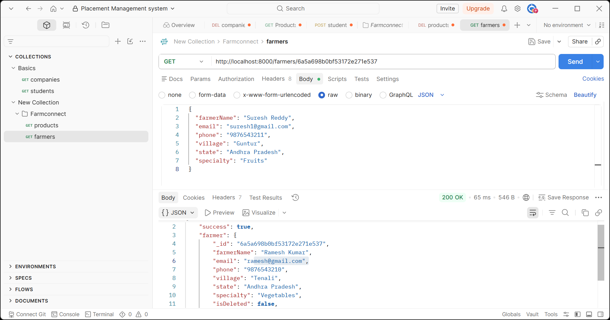
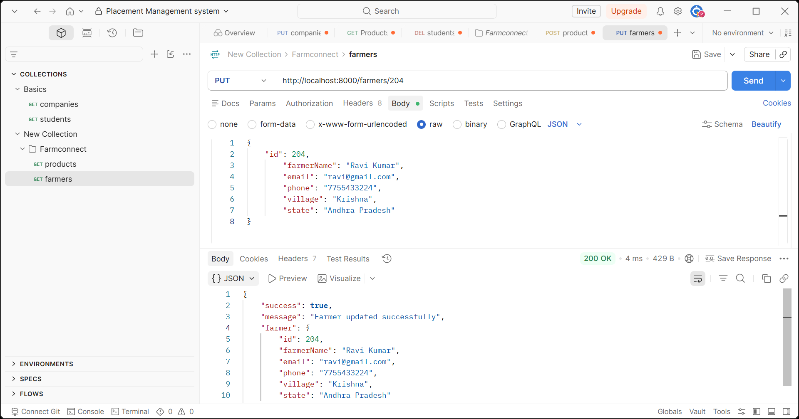
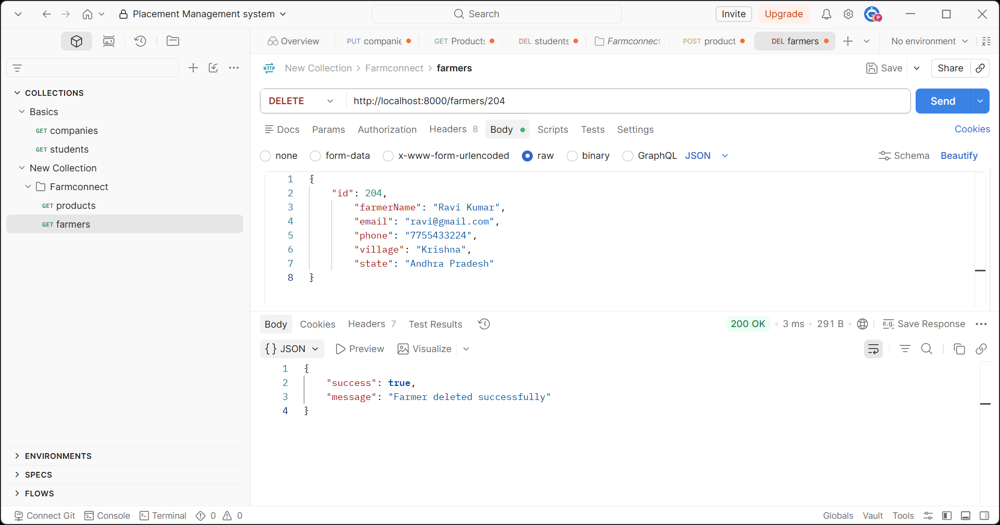

# Farm Connect Backend

## Project Overview

Farm Connect Backend is a REST API developed using **Node.js**, **Express.js**, **MongoDB Atlas**, and **Mongoose**. It provides APIs to manage farmers and products for the Farm Connect application.

## Technologies Used

* Node.js
* Express.js
* MongoDB Atlas
* Mongoose
* dotenv
* Nodemon

## Project Architecture

```
backend/
│
├── config/
│   └── db.js
├── controllers/
│   ├── farmerController.js
│   └── productController.js
├── models/
│   ├── Farmer.js
│   └── Product.js
├── routes/
│   ├── farmerRoutes.js
│   └── productRoutes.js
├── server.js
├── package.json
├── .env
└── .gitignore
```

## Database Schema

### Farmer

* id
* farmerName
* email
* phone
* village
* state

### Product

* id
* productName
* farmerName
* category
* quantity
* price
* location

## REST API Endpoints

### Farmer APIs

| Method | Endpoint     | Description      |
| ------ | ------------ | ---------------- |
| GET    | /farmers     | Get all farmers  |
| GET    | /farmers/:id | Get farmer by ID |
| POST   | /farmers     | Add a new farmer |
| PUT    | /farmers/:id | Update farmer    |
| DELETE | /farmers/:id | Delete farmer    |

### Product APIs

| Method | Endpoint      | Description       |
| ------ | ------------- | ----------------- |
| GET    | /products     | Get all products  |
| GET    | /products/:id | Get product by ID |
| POST   | /products     | Add a new product |
| PUT    | /products/:id | Update product    |
| DELETE | /products/:id | Delete product    |

## API Testing

The REST APIs were tested using Postman.

Add the following screenshots in this section:

* GET Farmers
* GET Farmer By ID
* POST Farmer
* PUT Farmer
* DELETE Farmer
* GET Products
* GET Product By ID
* POST Product
* PUT Product
* DELETE Product

## Environment Variables

Create a `.env` file with the following variables:

```
PORT=8000
MONGO_URI=your_mongodb_connection_string
NODE_ENV=development
```

## Postman API Testing

### GET All Products



### GET Product By ID



### POST Product


### PUT Product



### DELETE Product



### GET All Farmers



### GET Farmer By ID



### POST Farmer


### PUT Farmer



### DELETE Farmer


## Author

Pujitha
